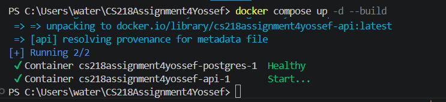
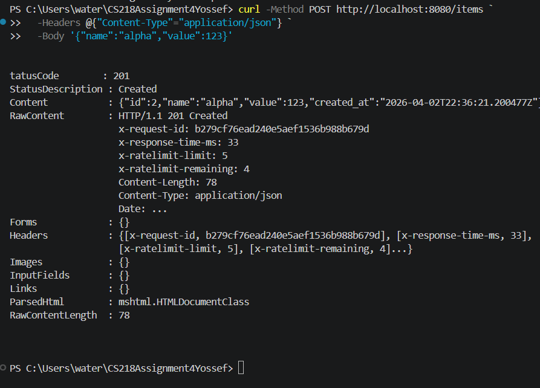
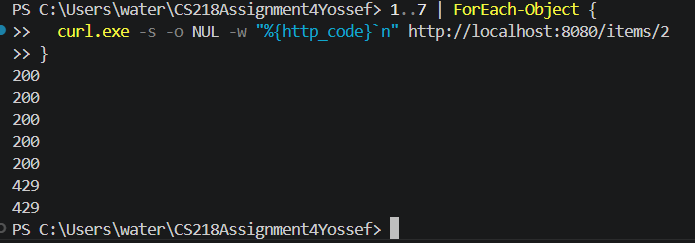
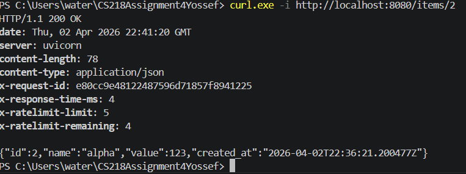

Assignment 4 Yossef

my github link: https://github.com/Yossefgit/CS218Assignment4Yossef.git

I chose to do option 2 which is rate limiting

so basically my limiter allows 5 requests in 10 seconds and if there are more than 5 requests in 10 seconds we get a 429 which means there are too many requests.

instructions:

1 run the program
docker compose up -d --build

2 we make one order for the rate limit testing
curl -Method POST http://localhost:8080/items `
  -Headers @{"Content-Type"="application/json"} `
  -Body '{"name":"alpha","value":123}'

3 we run this command below and basically what it does is send 7 requests quickly under 10 seconds and because our rate limiter is 5 requests per 10 seconds, if it works correctly we should get 5 200's and 2 429 which means 5 requests were good and the rate limiter threw the too many requests error twice. 

ID needs to match the id created in 2

1..7 | ForEach-Object {
  curl.exe -s -o NUL -w "%{http_code}`n" http://localhost:8080/items/2
}

4 to show that the rate is only for 5 requests in a 10 second time period, after waiting more than 10 seconds if we run 1 request we should get a 200 again for it and not a 429 which means it won't count as an 8th request but rather it would count as a 1/5 requests

ID needs to match the id created in 2

curl.exe -i http://localhost:8080/items/2
